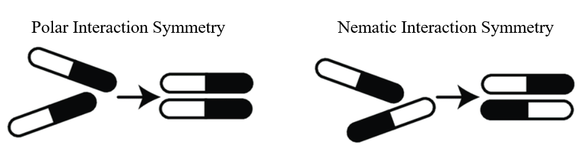

# Hoomd-ActiveTurningParticles
Plugin for [Hoomd-Blue](https://glotzerlab.engin.umich.edu/hoomd-blue/) that simulates persistent-turning, self-propelled (active) particles.

Below are examples of simulations produced by this code for particles that have polar (left) and nematic (right) alignment symmetry.
- Simulation movies are created by [demo.sh](https://github.com/crpackard/Hoomd-ActiveTurningParticles/blob/main/demo.sh).

<p float="center">
  
  
</p>

## Model Description

The equations of motion numerically solved by this repository are described here.
- The computational implementation is given in [TwoStepColoredVicsek](https://github.com/crpackard/Hoomd-ActiveTurningParticles/tree/main/TwoStepColoredVicsek).

A system of $N$ particles move in a square, periodic domain of linear size $L$.

Each particle maintains a constant self-propulsion speed $v_0$, and moves in the direction of its orientation $\theta_i$, such that its position evolves in time according to

```math
\frac{d\vec{r}_i(t)}{dt} = v_0\begin{bmatrix} \cos\theta_i(t) \\ \sin\theta_i(t) \end{bmatrix}.
```

A particle's orientation evolves in time via interactions with its instantaneous set of neighbors and a noise according to

```math
\frac{d\theta_i(t)}{dt} = \frac{\alpha}{\left|\mathcal{N}_i(t)\right|}\sum_{j\in\mathcal{N}_i(t)}\sin\left[m\left(\theta_j-\theta_i\right)\right] + \omega_i(t).
```

Note that:
- The parameter $\alpha$ controls the strength of particle-particle orientational alignment interactions.
- The term $\mathcal{N}_i(t)$ denotes the set of interacting neighbors of particle $i$ at time $t$, which is defined as all other particles within a metric radius of $R=1$ of particle $i$.
  - The term $\left|\mathcal{N}_i(t)\right|$ denotes the size of the set $\mathcal{N}_i(t)$; i.e., the number of interacting neighbors.
- The parameter $m$ dictates the symmetry of particle interactions. When $m=1$ particles experience polar alignment interactions, and $m=2$ particles experience nematic alignment interactions (as schematically shown below).

<p  style="text-align: center;">
  
</p>

The term $\omega_i$ corresponds to the rotational frequency of a particle's orientation, and evolves in time according to

```math
\frac{d\omega_i(t)}{dt} = \frac{\beta}{\left|\mathcal{N}_i(t)\right|}\sum_{j\in\mathcal{N}_i(t)}\left(\omega_j-\omega_i\right) - \frac{\omega_i(t)-\omega_0}{\tau} + \eta\zeta_i(t)\,.
```

The terms appearing in the equation are described as follows:
- The parameter $\beta$ controls the strength of particle-particle rotational frequency alignment interactions.
  - When $\beta=0$, the equation of motion becomes a generic [Ornstein–Uhlenbeck process](https://en.wikipedia.org/wiki/Ornstein%E2%80%93Uhlenbeck_process).
- The parameter $\tau$ controls the persistence (or "memory") time.
- The parameter $\omega_0$ is a bias in the rotational frequency.
- The parameter $\eta$ is the strength of the Gaussian white noise $\zeta_i(t)$.

This model has previously been numerically studied by [Nagai et al. (PRE, 2015)](https://journals.aps.org/prl/abstract/10.1103/PhysRevLett.114.168001).

## Installation

The script [setup.sh](https://github.com/crpackard/Hoomd-ActiveTurningParticles/blob/main/setup.sh) automates:
1. The unpacking and building of [hoomd-v2.8.2.tar.gz](https://github.com/crpackard/Hoomd-ActiveTurningParticles/blob/main/hoomd-v2.8.2.tar.gz).
2. The creation of a *Python* [virtual environment](https://docs.python.org/3/library/venv.html) for running simulations.

This script was written for and tested on a machine running ```Ubuntu 18.04.6 LTS``` with ```Python 3.6.9``` and ```cmake version 3.25.2``` already installed.

## Application To Biological Systems

- [C. Elegans](https://www.nature.com/articles/s41467-019-08537-y)
  - Caenorhabditis elegans collectively form dynamical networks of bundle-shaped aggregates under proper experimental conditions.
  - Average agent length $\approx1{mm}$
  - 
- [Microtubules](https://www.nature.com/articles/nature10874)
  - Microtubules propelled by surface-bound dyneins self-organize into vortices which possess a lattice structure.
  - Average agent length $\approx15\mu{m}$
  - 
- [Escherichia coli](https://www.nature.com/articles/nature20817)
  - Millions of motile cells in dense bacterial suspensions self-organize into highly robust collective oscillatory motion.
  - Average agent length $\approx3\mu{m}$
  - 
- [Serratia marcescens](https://www.nature.com/articles/s41586-024-07114-8?fromPaywallRec=false)
  - Dense bacteria spontaneously develop a lattice of mesoscale, fast-spinning vortices with strong polar and vortical order.
  - Average agent length $\approx2\mu{m}$
  - 
